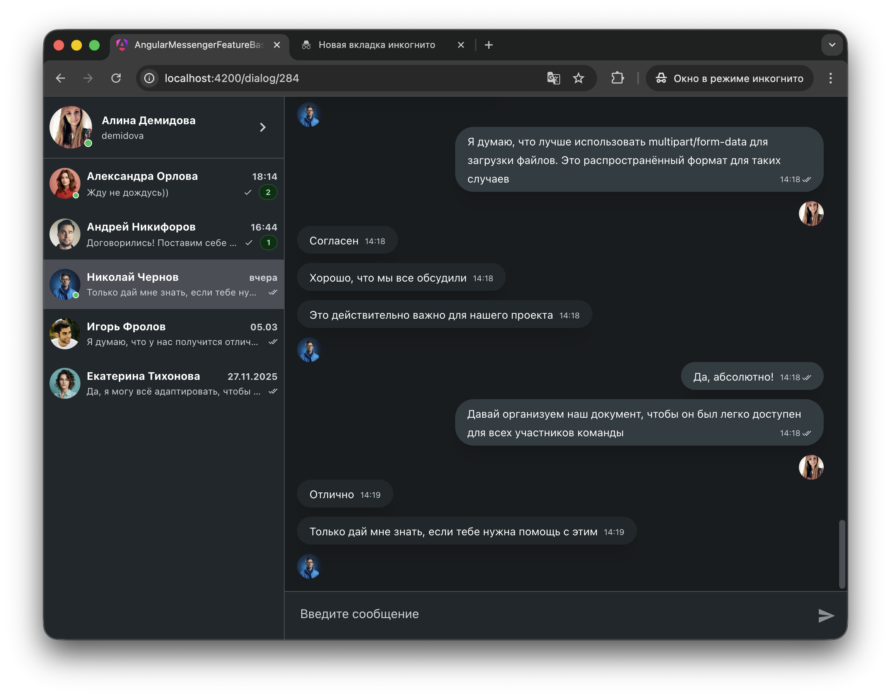
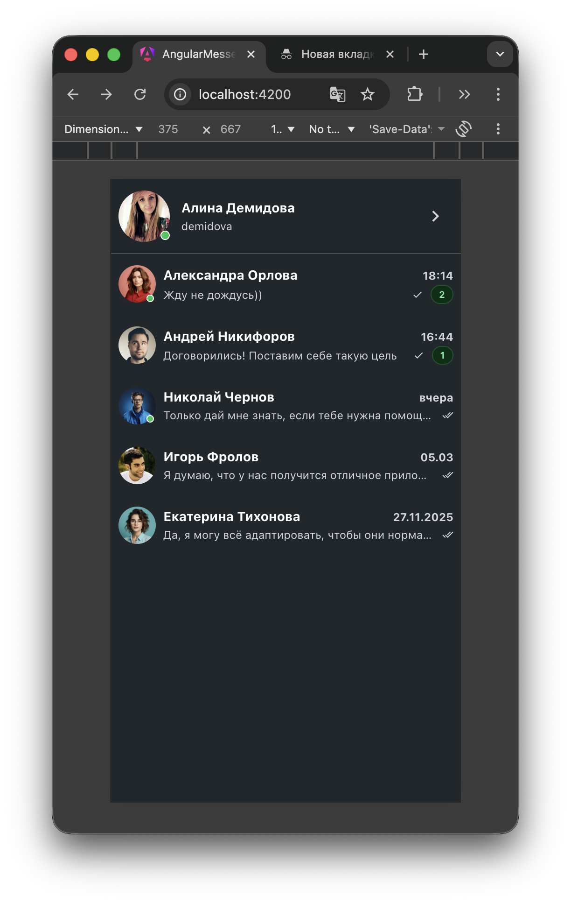
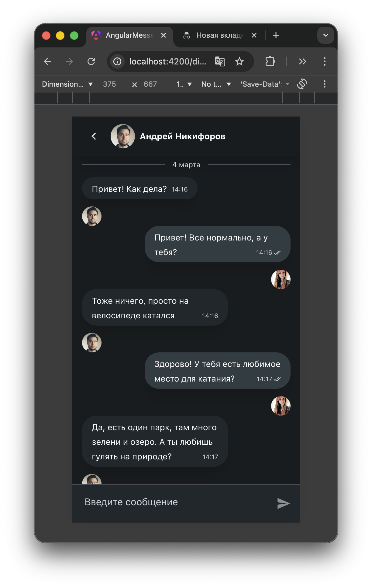
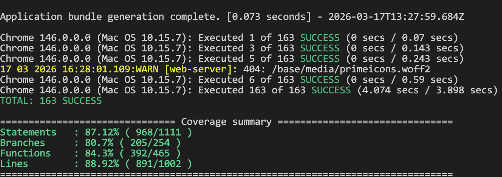

## Демонстрация работы приложения

Главная страница приложения:



Адаптивная верстка для мобильных устройств:




Видеодемонстрацию работы приложения можно посмотреть на rutube:
https://rutube.ru/video/private/a4c16fc3fcb3d84fb2f8466a21af9b18/?p=q_noo8z-gY-ksajCtaq38g

#### Временные затраты на разработку frontend части составили примерно 250 часов

## Функциональные требования

Требуется разработать приложение мессенджер, реализующее следующий функционал:

1. Регистрация, авторизация, выход из учетной записи пользователя
2. Редактирование информации о пользователе
3. Добавление в список контактов по уникальному коду приглашения
4. Удаление пользователей из списка контактов
5. Возможность отправки, редактирования, удаления сообщений
6. Отображение и изменение статуса «прочитано» у сообщений
7. Группировка по датам и вывод сообщений в список
8. Автоматическая подгрузка сообщений при прокрутке списка вверх
9. Сохранение состояния ввода при переключении диалогов
10. Отображение и изменение статуса онлайн у пользователей
11. Отображение оповещений пользователя об успехе или ошибке при выполнении действий
12. Покрытие кода тестами (unit, integration, e2e)

## Технологический стек

- Angular 21
- Nest js
- ngrx/signals
- PrimeNg, Tailwind
- ngx-socket-io
- Jasmine + Karma + Angular testing library
- Playwright

## Тестирование приложения

Код приложения покрыт unit, integration и e2e тестами.

### e2e тесты

Для разработки e2e тестов использовался фреймворк playwright.

Всего разработано 2 вида e2e тестов

1. Тестирование основных функций приложения для одного пользователя: авторизация, редактирование информации о пользователе, работа с сообщениями.
2. Тестирование функций взаимодействия с веб-сокетом.

Для их запуска требуется ввести команду

```js
npm run e2e
```

### Unit и integration тесты

Для запуска этого вида тестов необходимо выполнить команду

```js
npm run test
```

### Coverage:


